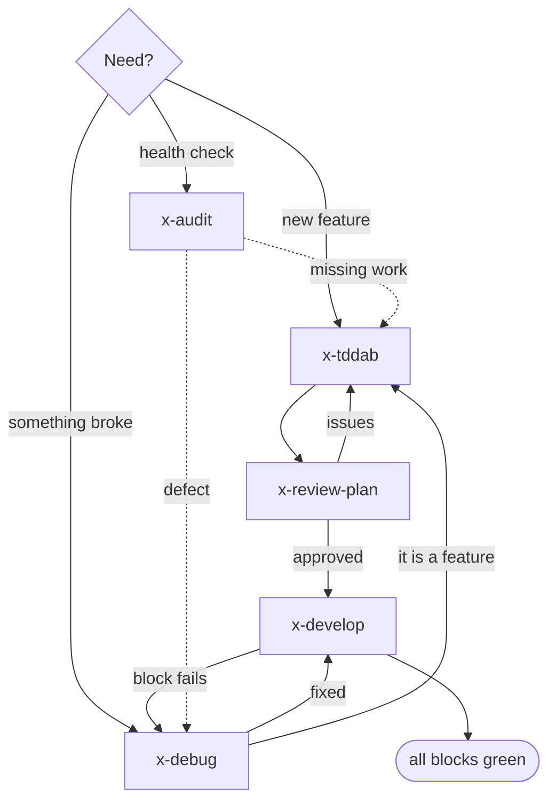

# cppskills -- C++ commands for Claude Code (a gift kit)

A small, self-contained set of Claude Code slash-commands for C++ projects,
plus the mindset files they depend on. Drop-in: no external apparatus, no
Memory Bank, no settings required (one optional settings stub if you want it).

Derived from a larger junior/senior workflow toolkit, scoped down to C++ and the
field-test lessons from the erhe / clangd work.

## Install

Copy the `commands/` folder into your project's `.claude/`:

```
your-project/
+-- .claude/
    +-- commands/        <- copy the contents of cppskills/commands/ here
        +-- x-audit.md
        +-- x-debug.md
        +-- x-tddab.md
        +-- x-review-plan.md
        +-- x-develop.md
        +-- cpp-project.md          (optional settings stub)
        +-- mind-sets/              (the files the commands read)
```

Then invoke a command in Claude Code by name, e.g. `/x-debug`, `/x-audit`.

## Commands

| Command          | What it does |
|------------------|--------------|
| `/x-debug`       | Debug a C++/native problem with **Protocol D** (RIDHV): build / link / runtime (gdb-lldb) / sanitizer / GPU-validation / logic. Evidence-first, one change at a time. |
| `/x-audit`       | Architecture + foundations + security audit against the 16 C++ foundations (warnings-as-errors, RAII, dependency pinning, sanitizers, ...). |
| `/x-tddab`       | Plan a feature as **TDDAB** blocks (RED -> GREEN -> VERIFY) with Catch2/CTest. |
| `/x-review-plan` | Review a TDDAB plan: structure, dependency ordering, self-sufficiency, and a cross-check against the real codebase. |
| `/x-develop`     | Implement a reviewed plan block-by-block as a senior C++ dev: failing test -> minimum code -> build clean + ctest + clang-tidy + ASan/UBSan. |

## How the commands fit together (help)

Nodes are the commands; edges are the flow. What each command does is in the
table above and in "When to reach for each" below.



### Plain-text version (same flow)

```
   x-tddab --> x-review-plan --> x-develop --> all blocks green
                    ^  issues        |
                    +----------------+   (x-debug whenever a block breaks)

   x-debug   standalone, anytime something breaks
   x-audit   standalone, periodic checkup
```

### When to reach for each

- **`/x-debug`** -- the moment anything misbehaves. Standalone, no plan needed. Always Protocol D.
- **`/x-audit`** -- periodic checkup, or before a release. Standalone.
- **`/x-tddab` -> `/x-review-plan` -> `/x-develop`** -- the build loop for any non-trivial feature. Plan, get it reviewed (catches ordering / missing-symbol / reuse issues *before* coding), then implement one verified block at a time.

## Optional: `cpp-project.md`

The commands work with generic CMake/CTest commands out of the box. If your
build is non-standard (custom scripts, a specific clangd compile-commands dir,
device/emulator launch), fill in `commands/cpp-project.md` with your real
commands -- every command will pick them up automatically.

## Mindsets included (read by the commands)

`project-foundations.md` (base) - `project-foundations-cpp.md` - `cpp-senior.md`
- `cpp-tddab-overlay.md` - `tddab-planner.md` - `audit.md` - `debug-protocol.md`
- `common-coding-style.md`

All ASCII, self-referencing only. No other files required.
