# AI creations: MCP-driven scene building in the erhe editor

"Creations" are showcase scenes built by an AI agent (or any script)
driving the **in-editor MCP server** - the editor's live JSON-RPC
scripting surface - from self-contained Python scripts in
`scripts/creations/`. Each script launches the editor, builds one scene
end to end (geometry, materials, procedural textures, lighting, physics),
frames the camera, screenshots itself for iteration, and saves the scene
as glTF. Seventeen creations exist, from a Conway-automaton cathedral to
physics-settled rock piles; `git log -- scripts/creations` carries the
per-creation history, and video recordings are collected in the
[erhe YouTube playlist](https://youtube.com/playlist?list=PLkxdzwaNHiJZVrlre-Y_LBxCzZaOObH9N).

This document maps the creation features to the editor features they are
built on. The **canonical workflow guide** (read before building or
revising a creation) is the `erhe-creations` skill:
`.agents/skills/erhe-creations/SKILL.md` plus its domain recipe files in
`.agents/skills/erhe-creations/references/`. The MCP server itself is
documented in `AGENTS.md` ("In-editor MCP server") and the repo-root
`mcp_server_usage.md`.

## Architecture

```
creation script (scripts/creations/creation_N_*.py)
        |  imports
scripts/creations/common.py        shared Creation API + math helpers
        |  uses
scripts/erhe_mcp.py                JSON-RPC client (retry, bearer token)
        |  HTTP POST http://127.0.0.1:8080/mcp
src/editor/mcp/mcp_server.*        in-editor MCP server (~180 tools)
        |  dispatches on the main thread, once per frame
editor subsystems                  scene graph, brushes, geometry,
                                   graphs, physics, renderer, glTF I/O
```

- The `editor` executable embeds the MCP server
  (`src/editor/mcp/mcp_server.{hpp,cpp}`, tool implementations split
  into `mcp_server_scene_query.cpp`, `mcp_server_scene_action.cpp`,
  `mcp_server_physics.cpp`, `mcp_server_graphs.cpp`, and friends;
  schemas in `mcp_server_tool_list.cpp`). It listens on
  `127.0.0.1:8080` (fallback scan to 8100), runs on a background
  thread, and queues every call to the main thread - so it can drive a
  *running* editor safely, windowed or headless.
- Creations work against the **windowed Release** build by default and
  the **headless Vulkan** build (`build_vs2026_vulkan_headless`,
  emulated swapchain) when no display is available. `capture_screenshot`
  works in both.
- Nothing in a creation is hand-edited in the UI: the script is the
  scene's source code, and only the script (plus `common.py` changes) is
  committed. Saved `.glb` outputs and screenshots are artifacts.

## Editor features the creations are built on

### Scene construction

| Creation feature | Editor feature underneath |
|---|---|
| `create_shape` (box, uv_sphere, cone, capsule, torus, disc, triangle, quad, rectangle, regular_polyhedron, convex_hull, sweep) | The Create-window brush generators (`Create_box`, `Create_uv_sphere`, ...) and `erhe_geometry::shapes` generators (`make_convex_hull` via Geogram Delaunay, `make_sweep` - closed profile swept along a bezier spine with parallel-transported frames) |
| One-call posed placement (`position`, `rotation_xyzw`, `scale`, `mass`, `motion_mode`, `parent_node_id`) | `Brush` instancing (`place_brush_in_scene`), node TRS transforms, rigid-body creation with inertia rescale; `motion_mode: "none"` detaches the physics attachment for pure-visual parts |
| Geometry reuse: pooled brushes, `place_brush`, `place_brush_instances` (N placements, one frame, one undo entry, `parent_index` chaining), pose nodes for scaled parents | The **content library** (per-scene brush/material/texture collections): every placement of one brush shares its `Primitive` (GPU buffers, raytrace shape); brushes persist in saved scenes via the `ERHE_brushes` glTF extension |
| `create_node` groups / joint anchors (mandatory one-subtree-per-object hierarchy) | Scene graph nodes with world-preserving reparent (`Node::set_parent`), `Item_insert_remove_operation` |
| `set_node_transform` (absolute, selection-free, undoable) | `Node_transform_operation`; teleports the rigid body to the pose without impulses |
| `create_material` / `edit_material` (base color, metallic, roughness, emissive, `blending_mode` + `opacity` for raster transparency, `transmission` for the ray tracer) | The PBR material system and per-scene material library |
| `create_light` / `edit_light`, `edit_camera` (`exposure`, `shadow_range`, `z_far`) | Scene lights (directional/point/spot) with shadow maps, camera projection and shadow-fit machinery |
| `set_scene_settings` (sky, grid, clear color, physics/wind overrides; `merge: true` deep merge) | Versioned per-scene `Scene_settings` (codegen serialization; unversioned sub-objects are rejected loudly - a missing `_version` would silently drop newer fields) |
| Undo safety everywhere | Every mutating tool goes through the editor's `Operation_stack`, so an AI-built scene is fully undoable in the UI |

**Strict tool arguments** (2026-08-09): `create_shape`, `place_brush`
and `place_brush_instances` reject unrecognized argument keys against
per-shape allowlists instead of silently applying defaults (a silently
ignored capsule `radius=` once cost a whole build); batch placements are
validated before any placement applies.

### Geometry processing

| Creation feature | Editor feature underneath |
|---|---|
| `csg` (union/intersection/difference, batched tool lists, world-space composed) | The CSG boolean mesh operation: replaces the target's primitives in place (id, transform, children, material, physics attachment survive), removes the tool nodes, rebuilds collision as a convex hull |
| `lattice_deform` (sparse FFD control-point offsets, bezier/linear, auto-fit cage) | Free-form deformation over the mesh's local bounds - billowed sails, bent trim strips, rippled pennants |
| `chamfer`, `remesh`, `decimate`, `smooth`, `catmull_clark`, `merge_faces`, ... with `node_ids` batches (no selection dance) | The async geometry operation framework (`operations/geometry_operations.*`): queued, undoable, previous selection restored server-side; edited pooled instances silently go private |
| `merge_static_subtree` | Transform-flattening operation that bakes a subtree into few nodes (built for the 11k-node tree garden -> 372 nodes, ~31 ms -> ~4 ms) |
| Mesh component selection (`select_mesh_components`, grow/shrink, attribute dumps) | The mesh-component editing mode; `get_mesh_attribute_values` exposes raw vertex/corner/facet attributes for offline analysis |

### Procedural graphs

| Creation feature | Editor feature underneath |
|---|---|
| `c.texture_graph()` + `texture_graph_*` tools (fbm, noise, colorize, math, output nodes), `set_material_texture_source` | The **texture graph** editor: GPU-evaluated procedural textures bound to material texture slots as live graph outputs |
| `c.geometry_graph()` + `geometry_graph_*` tools, `set_node_graph_mesh` | The **geometry graph** (geometry nodes) editor: node-based mesh generation bound to scene nodes as `Graph_mesh` assets |

### Physics

All physics is Jolt underneath (`erhe_physics`); the MCP layer exposes it
per node.

| Creation feature | Editor feature underneath |
|---|---|
| `create_physics_body` (`shape: "auto"` mesh hulls, mass, `gravity_factor`, `wind_receptivity`, `wake`), `edit_physics_body` | `Node_physics` attachments over Jolt rigid bodies; `auto` builds a convex hull of the node's own mesh |
| `create_physics_joint` + shared `create_physics_joint_settings` (limits + per-axis drives) | Six-dof Jolt constraints; drives with `position_target 0` act as **rest-pose motors** - the basis for swaying foliage and the standing spider ragdoll |
| `create_collision_filter` (self-denylist groups) | Jolt collision layers/filters - e.g. sibling sway spines that must not collide with each other |
| Scene wind (`common.wind`, `wind_*` settings) | Per-step force `receptivity * (wind_velocity - body_velocity)` on every receptive body, with gusts, turbulence and a wavelength phase field |
| `advance_time` (manual simulation clock: queue exact simulated seconds, `wall_clock`/`paused`/`manual` modes) | The editor's simulation time source - deterministic settles regardless of frame rate, window visibility or wall clock; ~10 simulated seconds settle in under a second |
| `toggle_physics {enabled}`, `wake_physics_bodies` (scoped: `node_ids` or a `node_name`/`node_id` subtree) | The dynamic-simulation enable and Jolt body activation; scoping keeps `--only` re-settles from waking (and toppling) already-settled structures elsewhere |
| `apply_physics_force` (force/torque/impulse at a point) | Direct Jolt body pokes - shove tests for balance rigs |

The combination enables **staged construction**: with the sim frozen
between explicit ticks, a script can place a body, tick 1.2 s, read the
landed pose (`get_node_details`), and place the next course on the
measured top - creation 17's cairn is stacked stone by stone this way,
with per-course verification and retry.

### Queries, verification, iteration

| Creation feature | Editor feature underneath |
|---|---|
| `capture_screenshot` (both builds) | Headless: synchronous emulated-swapchain readback; windowed: one-shot swapchain copy armed a frame ahead (`Device::request_frame_capture`) - captures the editor's own composited frame, immune to window occlusion |
| `get_scene_nodes`, `get_node_details` (transforms, attachments, per-mesh `world_aabb`, subtree-merged `subtree_world_aabb`) | Scene graph introspection; the subtree AABB feeds `common.frame()` camera auto-fit in one call |
| `geometry_query` (batched raycasts + closest-point-on-mesh), `raycast`, `pick_at` | The editor's raytrace scene (same mask as the viewport hover ray) and closest-point queries - probe the *actual* surface instead of guessing offsets (convex hulls bulge past their authored points) |
| `get_async_status` (pending + running + queued operations) | The async operation queue - `common.settle()` polls it to zero instead of sleeping fixed amounts |
| `batch` (N tool calls, one request, one frame, one undo entry) | Server-side sub-call dispatch for burst construction |
| `set_window_visibility`, `get_viewports` | ImGui window management - `presentation()` hides clutter and focuses the creation's viewport before captures |
| `select_items`, `get_selection`, `get_undo_redo_stack`, `delete_nodes` | Selection, undo stack introspection, recursive delete (the `--only` partial-rebuild primitive) |

### Persistence

| Creation feature | Editor feature underneath |
|---|---|
| `save_scene` / `load_scene` (`res/editor/scenes/creations/*.glb`) | The glTF exporter/importer with erhe extensions: `ERHE_brushes` (content-library brushes), `ERHE_physics` (bodies, joints, wind receptivity), `ERHE_scene` (scene settings) - a saved creation round-trips with its physics rig and brush pool intact |
| `export_gltf` / `import_gltf`, prefabs, asset manager tools | The broader asset pipeline (see `doc/asset_manager.md`) |

## The Python layer

`scripts/creations/common.py` is the shared client API; scripts import
it rather than re-deriving anything (the skill's "IMPORT these, never
re-derive" rule). Highlights:

- **`Creation`**: scene bootstrap (`new_scene`/`load`/`attach_scene`),
  busy-retry transport with mutation-safe timeout handling, per-tool
  call telemetry printed at exit, `settle()` on the async queue.
- **Shape pooling**: `shape()` keys on shape type + geometry parameters
  and turns repeated calls into `place_brush` instances of one brush;
  `part()`/`part_batch()` place unit-geometry parts sized by node TRS
  scale, flushed through `place_brush_instances`.
- **Cameras**: `place_camera(eye, target)` look-at,
  `shot_relative(node, local_eye, local_target)` object-local close-ups
  through the live world transform, `frame(node, azimuth, elevation,
  margin)` AABB-fitted framing (a fitted eye cannot land inside the
  object), `screenshot_views()` multi-angle capture.
- **Physics helpers**: `body()`, `joint()`, `joint_settings()`,
  `anchor()`, `wind()`, `set_physics()`, scoped `wake_physics()`,
  `advance_time()` / `run_simulation()` / `sim()` for the manual clock.
- **Fail-soft finalize**: `with common.fail_soft(c, base_path,
  failed_glb=None):` around the build - a crash still screenshots the
  aftermath (`<base>_failed.png`, optional `*_failed.glb`) and restores
  the wall clock before the exception propagates.
- **Placement math**: quaternion kit (`align_y_quaternion`, `quat_mul`,
  `quat_rotate`, `look_at_quaternion`), randomized-placement kit
  (`rand_quat` Shoemake, `tilt_yaw_quat`, `power_law_size`,
  `quantize_scale`), pose probes (`probe_tilt`, `probe_pose`,
  `hierarchy_report`).
- **Standard flags** (`standard_args`): `--reuse` (attach to the running
  editor, close previous scenes), `--editor-exe` (pick a build),
  `--pause N` (recording pause), `--no-save`, `--reframe <glb>`
  (camera/screenshot stage only, seconds instead of a rebuild),
  `--only <object>` (delete + rebuild one object's subtree against the
  live scene - measured ~2x fewer MCP calls than a full run).

## Workflow properties

- **Reproducible**: scripts self-launch the editor with
  `--commands config/editor/commands_empty.json` (the creation is the
  only scene), seed their own RNGs, and settle physics under the manual
  clock - the same script rebuilds the same scene windowed or headless
  at any frame rate (deterministic in simulated time; Jolt threading is
  not bit-identical across runs, so staged builders verify and retry).
- **Iterative by screenshot**: judge the PNG in `logs/creations/`, fix,
  rerun; composition problems (occlusion, framing, washed lighting) are
  the usual finds. Multi-angle shots surface them in one iteration.
- **Probed, not guessed**: surface-relative placement uses
  `geometry_query`, framing uses AABB fitting, and first use of any new
  tool/shape/parameter goes into a 30-second scratch-scene probe before
  a full run.
- **Hierarchy-disciplined**: every logical object is one subtree under
  its own group node, nesting mirrors construction logic (L-system
  bracket structure becomes the node parent structure), verified with a
  root-count/depth histogram.

## Relation to Tencent Hunyuan3D WorldClaw

[WorldClaw](https://tencent-hunyuan.github.io/Hunyuan3D-WorldClaw/)
(Tencent Hunyuan3D, "Agentic 3D Open-World Generation at Scale") is a
coarse-to-fine agentic framework that turns one open-ended text prompt
into an explicit, explorable, editable 3D world: intent becomes a
structured specification, a global terrain with region-aware semantics
is constructed, objects are generated only where regions call for
detail, and render-guided agents refine appearance, arrangement and
object-terrain contact - all driving Blender, with terrain materials
authored as executable Blender node graphs and shader scripts.

The two systems approach the same goal - agent-built, *editable* 3D
scenes - from opposite ends, and erhe's creation stack is essentially a
working instance of both items in WorldClaw's stated future work:

- **"Code-native 3D modeling."** WorldClaw notes that generative 3D
  backbones rarely recover explicit part hierarchies, parametric
  structure, articulation, or interaction logic, and proposes extending
  its code-authored terrain materials to object generation. erhe
  creations are code-native throughout: every object is an executable
  script over parametric generators, with an explicit part hierarchy
  (the mandatory one-subtree-per-object rule; L-system bracket
  structure mirrored in the node graph), adjustable parameters (species
  dicts, ship-yard knobs, profile/spine/taper sweeps), material logic
  as executable texture graphs, and articulation + interaction as real
  physics - six-dof joints with rest-pose motor drives, collision
  filters, wind receptivity. Composition and parameters stay explicitly
  editable because the script *is* the source: `--only` regenerates one
  object, `--reframe` re-runs only the camera stage, and every mutation
  is undoable in the editor.
- **"Production engine integration."** WorldClaw observes that Blender
  lacks runtime procedural generation, physics, and interaction, and
  calls for pairing its planning with engine-side procedural tooling.
  erhe's MCP server is exactly that engine-side tooling: the agent
  scripts the live engine/editor itself, so physics settling, wind,
  joints, rendering and persistence are the engine's own runtime
  systems, and the output loads back into the same engine with its
  physics rig and brush pool intact.

The honest converse: WorldClaw operates at open-world scale from a
single free-form prompt, uses generative backbones for object content,
and closes its quality loop with autonomous render-guided refinement
agents. erhe creations are scene-scale, purely procedural (no learned
3D generation - geometry comes from parametric generators, hulls,
sweeps, CSG and L-systems), and close the loop with the agent judging
`capture_screenshot` output between runs - the same render-guided
refinement idea, in miniature and with a human-readable program as the
artifact. WorldClaw's structure-first decomposition (global layout
specification before local content) is a natural fit for scaling
creations up beyond single showcase scenes.

## Creations timeline

All seventeen creations, latest first. Each image is the creation's hero
shot, captured with `capture_screenshot` - most from the saved scene
(`res/editor/scenes/creations/<name>.glb`) loaded back into the editor,
the same path any viewer takes; creations 1 and 13 are captured from a
fresh script build (geometry-graph mesh materials do not yet survive the
glb round-trip, and the glade rebuild carried the willow-curtain joint
fix). Dates are the scripts' first commits.

### 17 - Rockfall (2026-08-09)

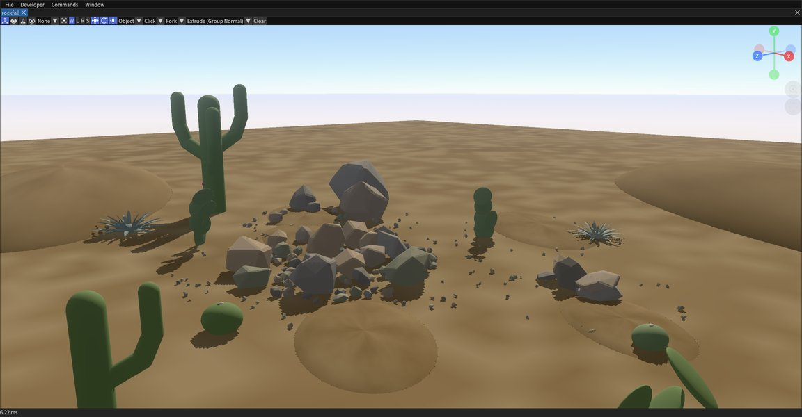

Physics-settled rock piles: convex-hull rocks from jittered
fibonacci-sphere point clouds, power-law sizes on pooled brushes, a
talus cone settled deterministically under the `advance_time` manual
clock, and a cairn STACKED course by course mid-simulation on measured
poses. Post-settle chamfer batches, smooth sunken-sphere dunes, capsule
cacti and swept-blade agave rosettes (the first use of the `sweep`
shape).

### 16 - Sail Ships (2026-08-09)

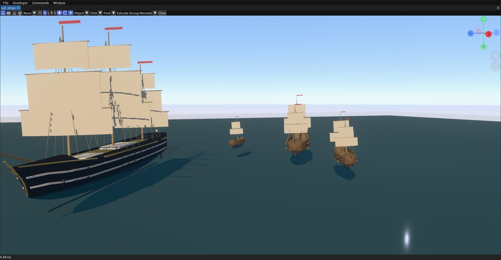

A fleet on open water: hulls are authored `convex_hull` silhouettes
carved with batched CSG (deck wells, gunports, transom windows, the
Amerigo Vespucci's concave clipper stem), sails are FFD-billowed boxes,
and the hull stripes are lattice-bent strips fitted to raycast-probed
surface stations.

### 15 - Tree Garden (2026-08-09)

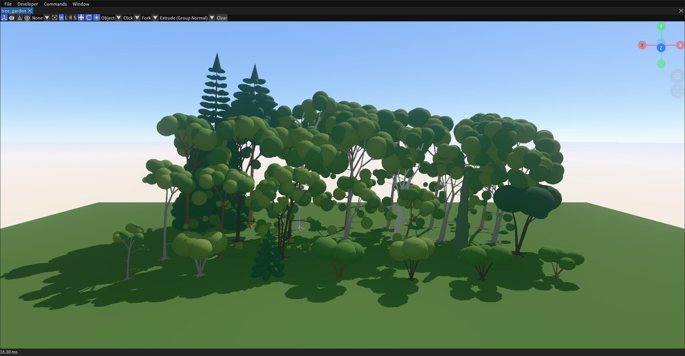

28 Finnish tree species at their real heights via the shared
`lsystem_trees.py` module (tropism, phyllotaxis, pipe-model radii,
curved branch chains with forks and twigs), each with beam-scaled
two-level wind sway. Also the performance testbed that motivated
`merge_static_subtree` (11057 -> 372 nodes, ~31 -> ~4 ms).

### 14 - Spider Sentinel (2026-08-08)

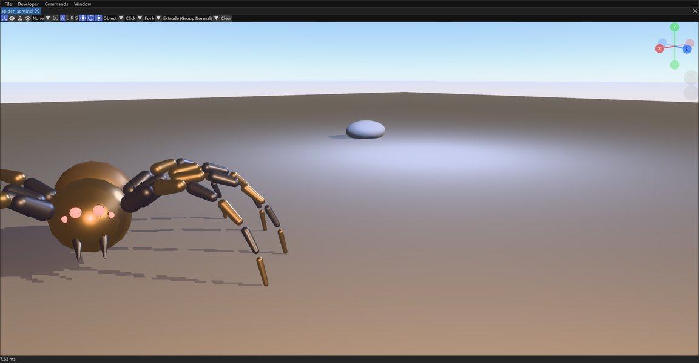

A 50-part ragdoll spider that STANDS under full gravity on motorized
leg joints - rest-pose six-dof drives sized from static hold torques -
and staggers and recovers from an `apply_physics_force` shove.

### 13 - Windswept Glade (2026-08-08)

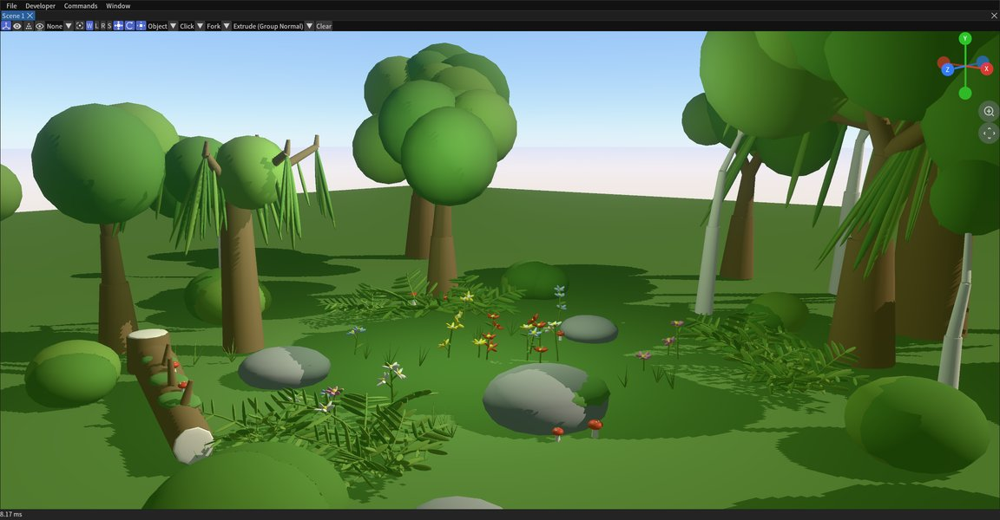

The forest glade rebuilt with living foliage: one-spine physics LOD per
plant (114 sway spines), rest-pose motor joints, per-body wind
receptivity and the scene wind system (gusts, turbulence, wavelength).

### 12 - UAP Hangar (2026-08-08)

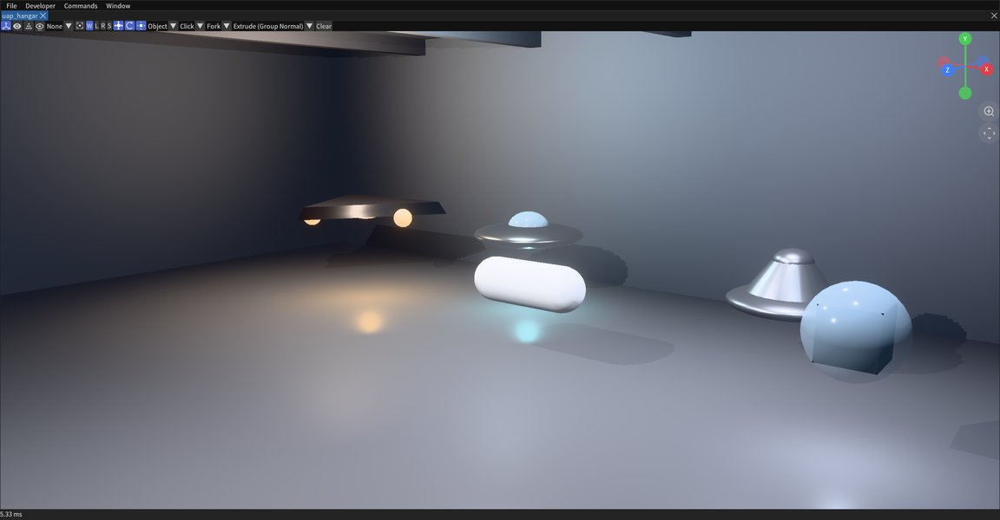

A dim hangar with five classic UAP silhouettes hovering in their own
light pools - TR-3B triangle, domed saucer, tic-tac, and friends - an
indoor-lighting study (no sky, accent point lights, emissive shells,
raster transparency).

### 11 - Monster Portal Island (2026-08-07)

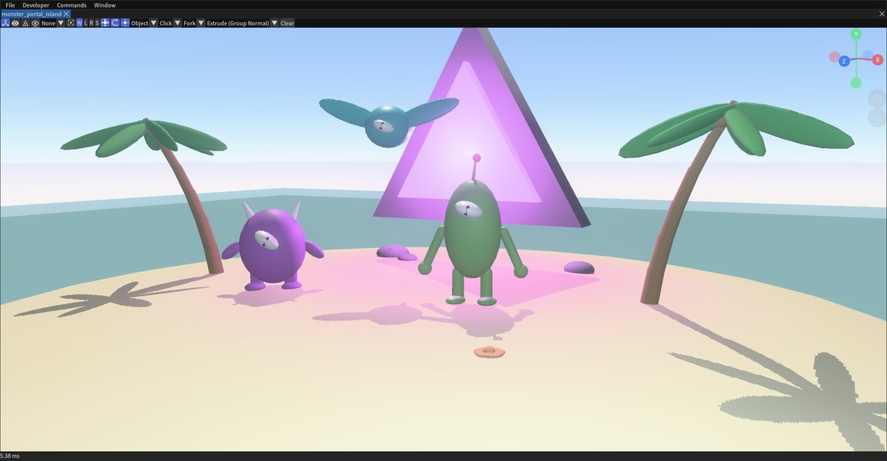

A tropical island with L-system palms and coral, a glowing portal ring,
and primitive-built critters mid-invasion - a composition and accent
lighting exercise (a 320-intensity portal light once turned the whole
island pink).

### 10 - Forest Glade (2026-08-07)

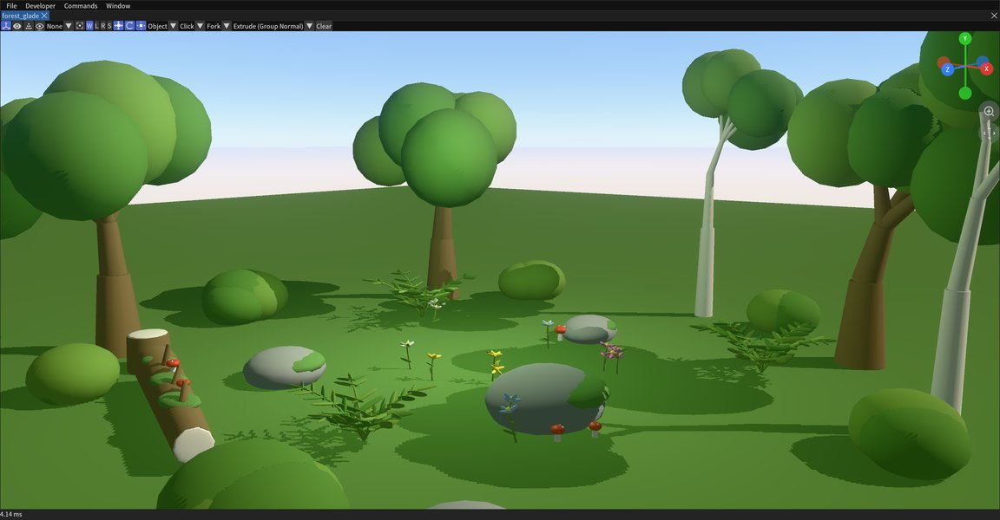

Two-species L-system trees, L-system bipinnate ferns and flowers, and a
fallen log - the creation that established the mandatory scene-graph
hierarchy rules (the L-system bracket stack IS the node parent stack;
742 nodes, 37 roots, depth 7).

### 9 - Sandbox Afternoon (2026-08-07)

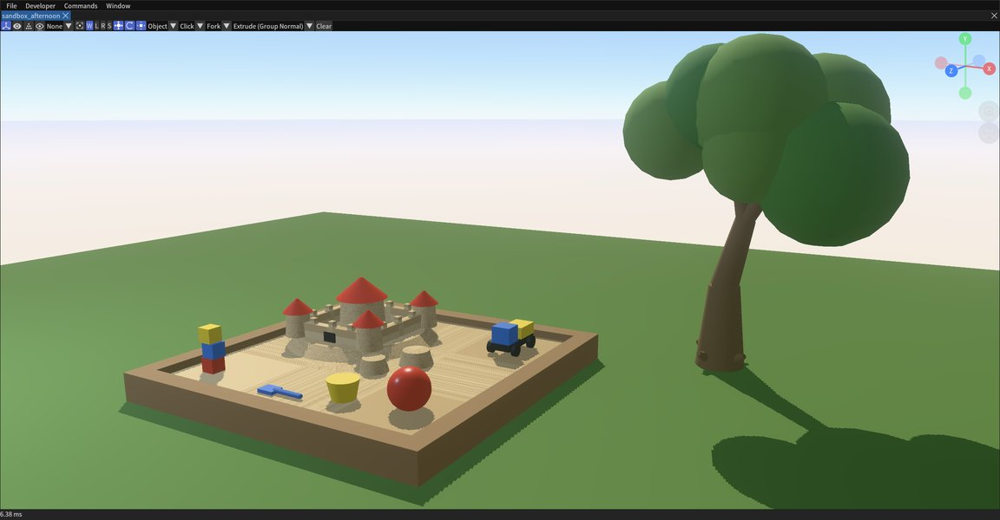

A backyard sandbox scene grown around the first L-system oak - the
proof that string-rewrite vegetation plus a 3D turtle works over the
MCP shape tools.

### 8 - The Glass Audience (2026-08-07)

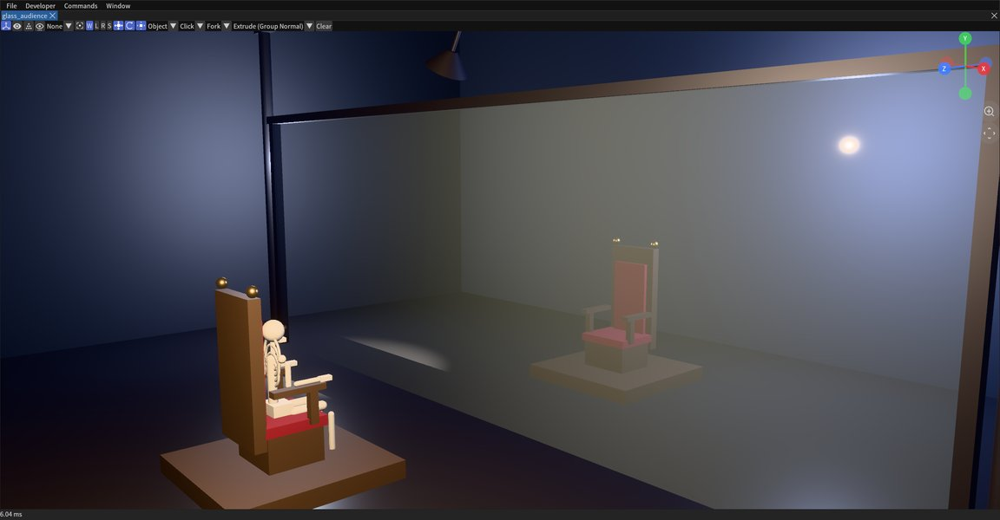

Two thrones facing each other through a clear glass wall, one seating a
primitive-built skeleton under a swinging pendulum lamp - the
transparency showcase (`blending_mode: "alpha_blend"` + opacity) and an
early physics-pendulum rig.

### 7 - Ragdoll Rumble (2026-08-07)

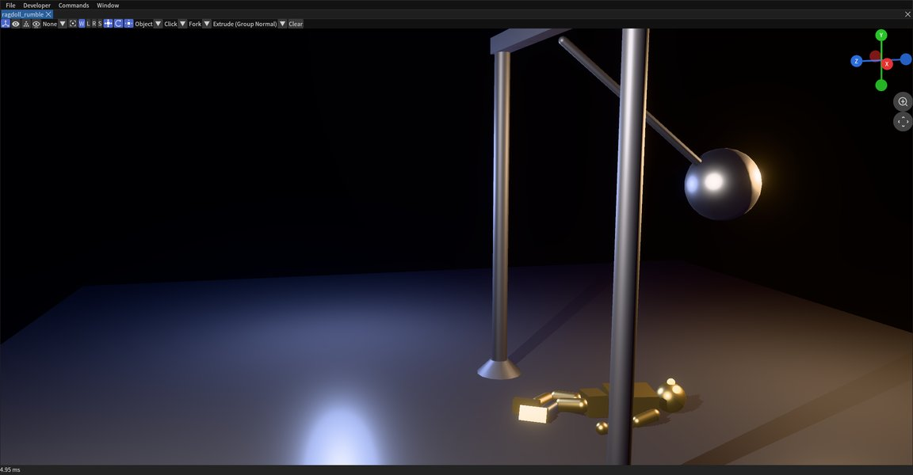

A golden protocol-droid homage vs a wrecking ball: every body part a
dynamic rigid body laced with ball/hinge/weld joints - the first full
physics-joint creation, frozen at the moment of impact aftermath.

### 6 - Robot Roll Call (2026-08-07)

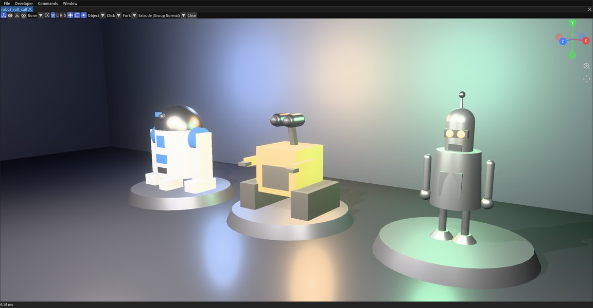

Three homage robots on lit showroom pedestals, each built entirely from
parametric shapes so the silhouette carries the character.

### 5 - The Spiral Reef (2026-08-07)

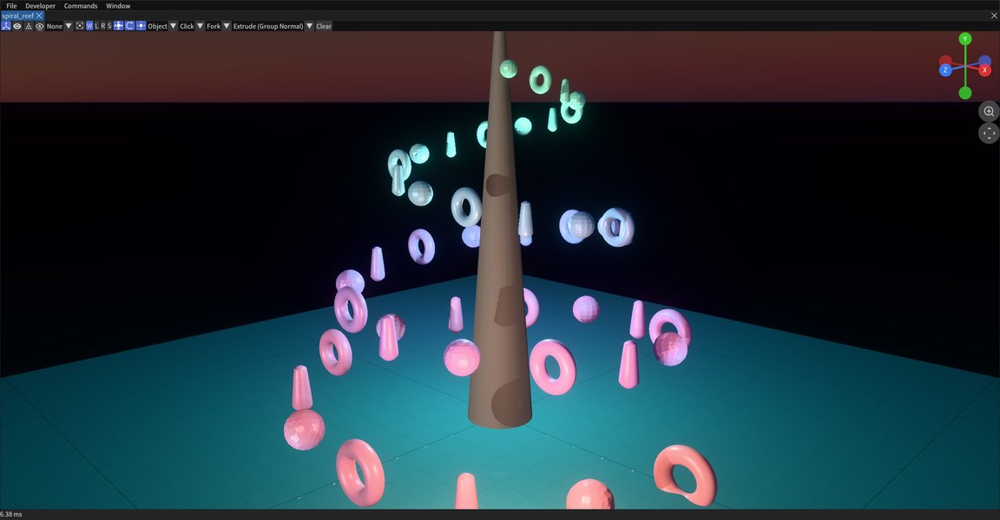

A double golden-angle helix of organic forms rising from a shallow sea,
sculpted after placement with direct MCP geometry operations.

### 4 - Megalith Henge at Dusk (2026-08-07)

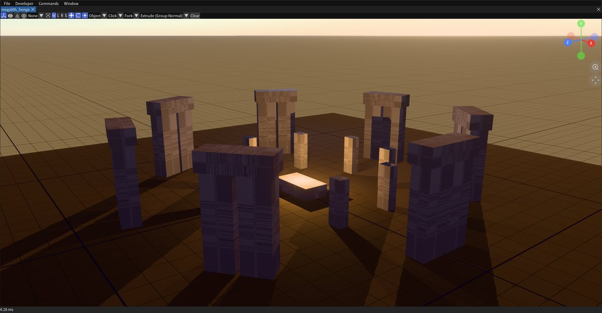

A weathered trilithon circle - the brush-reuse creation: monolith and
capstone authored once with `create_shape add_brush`, erected with
`place_brush`, surfaced with a procedural stone texture graph.

### 3 - The Texture Atelier (2026-08-07)

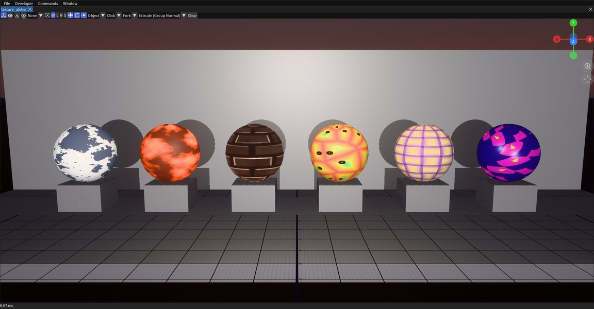

A gallery of spheres on plinths, each surfaced live by a different
procedural texture graph (marble, lava, bricks with a normal map,
voronoi stained glass, woven fabric, kaleidoscope).

### 2 - Crystal Garden at Night (2026-08-07)

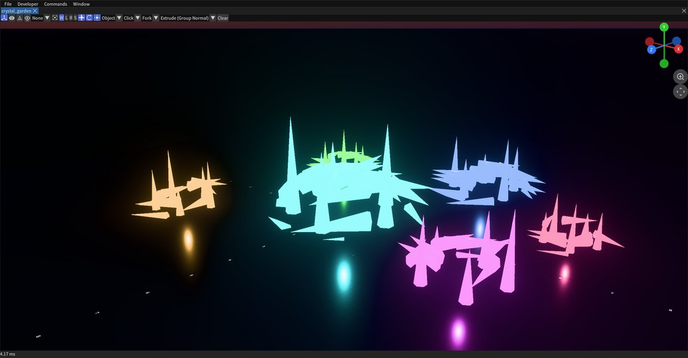

Emissive crystal clusters on a dark reflective ground, each cluster a
geometry node graph: points scattered over a hidden dome, instanced
with sharpened cones, realized into one mesh.

### 1 - Cathedral of Conway (2026-08-07)

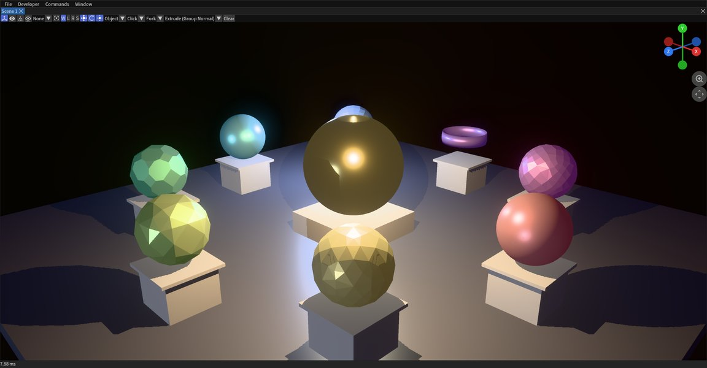

The first creation: a circular colonnade of pedestals, each carrying a
geometry-node sculpture built from a different Conway operator chain
(gyro, kis, chamfer, truncate, meta...) around a central gyro-sphere.

## Pointers

- `.agents/skills/erhe-creations/SKILL.md` - canonical workflow,
  hierarchy rules, gotcha index; domain recipes in
  `references/{vegetation,physics_rigs,csg_hulls,settling_rock_piles,blades_sweep}.md`.
- `AGENTS.md` "In-editor MCP server" + repo-root `mcp_server_usage.md` -
  server transport, ports, auth, headless vs windowed, Quest forwarding.
- `src/editor/mcp/mcp_server_tool_list.cpp` - the full tool schema
  (181 tools as of 2026-08-10); `scripts/mcp_call.py --list` against a
  running editor prints the live list.
- `scripts/creations/common.py` - the client API described above.
- [erhe YouTube playlist](https://youtube.com/playlist?list=PLkxdzwaNHiJZVrlre-Y_LBxCzZaOObH9N) -
  video recordings (the scripts' `--pause` flag exists exactly for
  starting a screen recording before the scene builds up).
